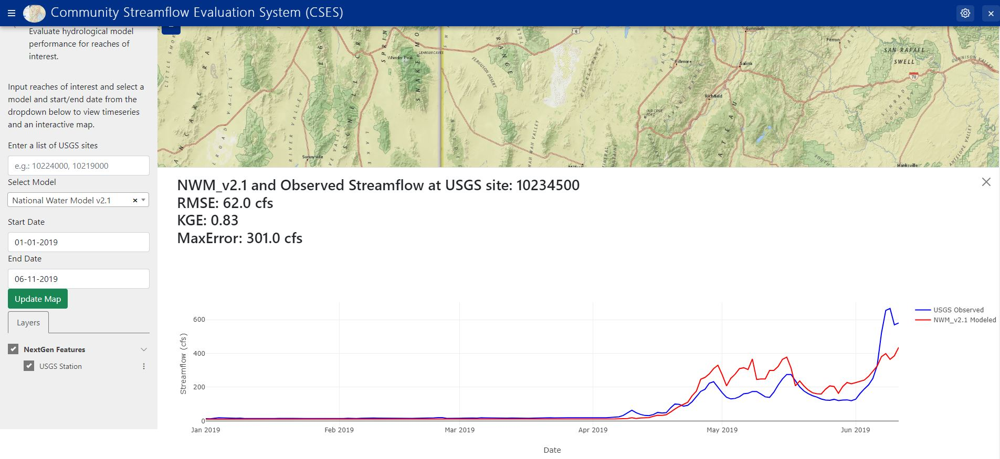

# Community Streamflow Evaluation System (CSES) - Tethys Web Application

A Novel Community Streamflow Evaluation System (CSES) to evaluate hydrological model performance, currently using a standardized NHDPlus data model.
CSES evaluates modeled streamflow to over 5,000 in situ USGS monitoring sites, providing interactive visualizations for an in-depth analysis.

## Application Overview
Given the launch of the [Cooperative Institute for Research to Operations in Hydrology (CIROH)](https://ciroh.ua.edu/) in April, 2020, CIROH scientists from 28 different academic, government, and private are working to improve the understanding of hydrologic processes, operational hydrologic forecasting techniques and workflows, community water modeling, translation of forecasts to actionable products, and use of water predictions in decision making.
National-scale streamflow modeling remains a modern challenge, as changes in the underlying hydrology from land use and land cover (LULC) change, anthropogentic streamflow modification, and general process components (reach length, hydrogeophysical processes, precipitation, temperature, etc) greatly influence hydrological modeling.
To benchmark model performance, characterize improvements in hydrological modeling formuations, and generate reproducible science, the team at the [Alabama Water Institute (AWI)](https://awi.ua.edu/) developed CSES to originally characterize the water supply forecasting skill of the National Water Model v2.1 in the Great Salt Lake Basin. 
The tool quickly scaled and with the support of the [Earth Science Information Partners (ESIP)](https://www.esipfed.org/), provided an opportunity to turn the novel evaluation platform into a web application.
This GitHub repository contains the code to create an innovative [Tethys Web Platform](https://www.tethysplatform.org/) to share our reseach tools with the great research and operational hydrological community.
By using Community-Streamflow-Evaluation-System, researchers and practitioners can interact with model outputs and evaluate the performance of hydrological models (current the NWM) for their region.

### State Evaluation Methods

The State_Controller.py file is the core of the State Evaluation methods. 
The evaluation class defaults to the great state of Alabama and the National Water Model v2.1 retrospective dataset, which is a fully functional page supporting interactivity to explore model performance.

Want to explore different states and date ranges, select a state from the dropdown, a different model (note, these models only work for a limited number of sites within the Great Salt Lake at the moment), and a date range of interest.
We suggest a date range no longer than 1-year, as longer ranges take much longer to load.
No plot showing, there likely is no model or observational data for the inputs, try a differnt location!

### Reach Evaluation Methods

The Reach_Controller.py file is the core of the Reach Evaluation methods. 
The evaluation class defaults to a select number of NWIS sites in southern Utah and the National Water Model v2.1 retrospective dataset.

Want to explore different reaches and date ranges, inputs a reach or list of reaches separated with commas into the text inputs, a model (note, these models only work for a limited number of sites within the Great Salt Lake at the moment), and a date range of interest.
We suggest a date range no longer than 1-year, as longer ranges take much longer to load.
No plot showing, there likely is no model or observational data for the inputs, try a differnt location!

### HUCid Evaluation Methods

The HUC_Controller.py file is the core of the HUC Evaluation methods. 
The evaluation class defaults to the Jordan River Basin in northern Utah and the National Water Model v2.1 retrospective dataset.

Want to explore different HUCs and date ranges, inputs a hucid or list of hucids separated with commas into the text inputs, a model (note, these models only work for a limited number of sites within the Great Salt Lake at the moment), and a date range of interest.
We suggest a date range no longer than 1-year, as longer ranges take much longer to load.
No plot showing, there likely is no model or observational data for the inputs, try a differnt location!

### Data 
Community-Streamflow-Evaluation-System leverages USGS/NWIS observations from 1980-2020 and colocated and while all data is publically available through the respective agencies, we found the download time to be preventative for a timely model evaluation. 
The Alabama Water Institute at the University of Alabama hosts NWM v2.1 retrospective for all colocated USGS monitoring stations at a daily temporal resolution and provides the data free of charge via access to Amazon AWS S3 cloud storage.
Community-Streamflow-Evaluation-System can quickly access observed and predicted data supporting a fast and repeatable tool for evaluating modeled streamflow performance.

## Looking for the research-focused CSES?
The python-based [Community-Streamflow-Evaluation-System](https://github.com/whitelightning450/Community-Streamflow-Evaluation-System) package provides a foundation to evaluate national hydrography dataset (nhd) based model outputs with colocated USGS/NWIS streamflow monitoring stations (parameter: 060) without the need to download in-situ or NWM v2.1 data (NWM v3.0 coming soon!). 
The package is similar to the web application but supports a hands-on approach to model evaluation, such as providing a template and data model for researchers to evaluate their model.

## Want to see your model in the App?
Please reach out the AWI team so we can put your model results in our AWS S3 database.
We currently have a simple data model and are looking into more computationally effient methods to expedite interactivity and the overall hydrological evaluation experience.

## Want to contribute?
Reach out to the AWI team and we can identify meaningful areas to grow CSES.
Community is in the name for a reason and we intende to integrate more hydrological modeling components into the tool kit as funding allows.
Specific areas of contribution include snow, atmospheric forcings, and other model outputs.
Let's advance the community modeling paradigm together!
